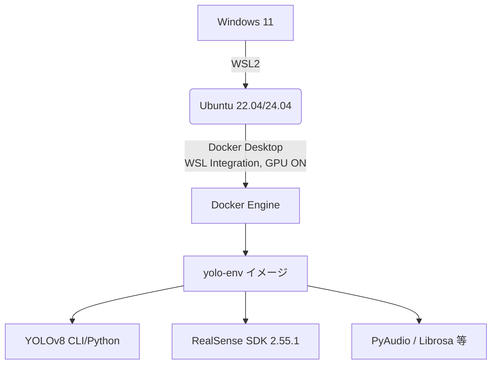

# 視覚障害者ナビゲーション研究 ― 開発環境 / データ / 手順まとめ  
(README_for_CustomGPT.md, 2025‑07‑22)

## 1. 研究の目的
- **RealSense RGB‑D + 音響 + ディープラーニング** を用いて  
  視覚障害者向けナビゲーション支援システムを構築する  
- ランドマーク検出 → 障害物回避 → 経路案内を統合

## 2. ゴール
| フェーズ | 成果物 |
| -------- | -------------------------------------------- |
| **環境構築** | GPU 対応 Docker (WSL2) 上で YOLOv8 が学習・推論できる |
| **データ準備** | 屋外: OpenImagesV7 ／ 屋内: SUN RGB‑D <br>音響: AudioSet 抽出 or 自作定位データ |
| **モデル開発** | RGB‑D 単独 → マルチモーダル (Late / Mid / Joint Fusion) へ拡張 |
| **評価** | ランドマーク検出 mAP, 距離誤差, 音源方位推定精度 |
| **実証** | RealSense + ReSpeaker を搭載した携帯型デバイスで試走 |

## 3. 必須ハードウェア
| 項目 | 推奨 |
| ---- | ---- |
| GPU | NVIDIA RTX 4070（開発機）／ GTX 1650（再現機） |
| CPU/RAM | 8C16T / 32 GB 以上 |
| ストレージ | NVMe SSD 500 GB+ |
| センサ | Intel RealSense D457, ReSpeaker Mic Array v2.0 |
| マイク | ReSpeaker On‑board DSP (NS/AGC/AEC/BF †切替可能) |

## 4. ソフト構成

## 5. Dockerfile (最小構成例)
```mermaid
FROM nvidia/cuda:12.1.1-base-ubuntu22.04
RUN apt-get update && \
    apt-get install -y python3.10 python3.10-dev python3-pip \
                       git curl libgl1 libglib2.0-0 && \
    ln -sf /usr/bin/python3.10 /usr/bin/python && \
    pip install --upgrade pip && \
    pip install ultralytics opencv-python torch torchvision torchaudio \
               pyrealsense2
WORKDIR /workspace
CMD ["bash"]
```

## 6. ビルド & 実行
```mermaid
# 1. ビルド
docker build --no-cache -t yolo-env .

# 2. コンテナ起動 (GPU, プロジェクト共有)
docker run --gpus all -it --rm \
  -v ~/depth_project:/workspace \
  --name yolov8-container yolo-env
```

## 7. 主要コマンド集
| 目的 | コマンド |
| ---- | ---- |
|サンプル推論|	yolo detect predict model=yolov8n.pt source=bus.jpg|
|自前学習|	yolo detect train data=data.yaml model=yolov8n.pt epochs=50 imgsz=640|
|RealSense ビューア|	python depth_view_rect_avg.py --bag xxx.bag|
|Audio スペクトル表示|	python plot_psd.py --wav splash.wav|

## 8. データセット取得メモ
### 8‑1. OpenImages V7 抽出
```mermaid
git clone https://github.com/EscVM/OIDv6_ToolKit.git
python main.py downloader \
  --dataset train --classes "Vending machine" "Pedestrian crossing" \
  --limit 500 --yolo
```

### 8‑2. SUN RGB‑D
- Official website から RGB＋BBox を DL

- sunrgbd_to_yolo.py でラベル変換

### 8‑3. AudioSet
- audioset_downloader.py --labels water,vending_machine --limit 300

- STFT → Mel → PNG 変換

## 9. モデル拡張ロードマップ
1. YOLOv8 (RGB) baseline

2. RGB + Depth：YOLO 入力に深度チャネル追加

3. Late Fusion：RGB‑D 推論結果 + 音響 DoA を後段で融合

4. Mid‑level Fusion：Neck 層で音響特徴マップ連結

5. Joint Fusion：Transformer でマルチモーダル統合

## 10. リスクと対策
|リスク|対策|
| ---- | ---- |
|Docker ネットワーク／RST_STREAM エラー	|BuildKit off, プロキシ除外, ext4 内ビルド|
|OpenCV libGL エラー|	apt install libgl1 libglib2.0-0
|.pt ダウンロード破損|	手動 DL or プロキシ環境変数設定
|RealSense 解像度不整合|	rs.align + 1920×1080⇔1280×720 設計を明示
|データ量肥大|	OI クラスフィルタ / lazy download

## 11. 参考リンク
- Ultralytics YOLOv8 https://docs.ultralytics.com

- OpenImages V7 https://storage.googleapis.com/openimages/web/download_v7.html

- RealSense SDK https://github.com/IntelRealSense/librealsense

- NVIDIA Container Toolkit https://docs.nvidia.com/datacenter/cloud-native/

† DSP切替：amixer -c <card#> sset 'Beamforming' off など HID/ALSA コマンドでオンボード処理を無効化可能。